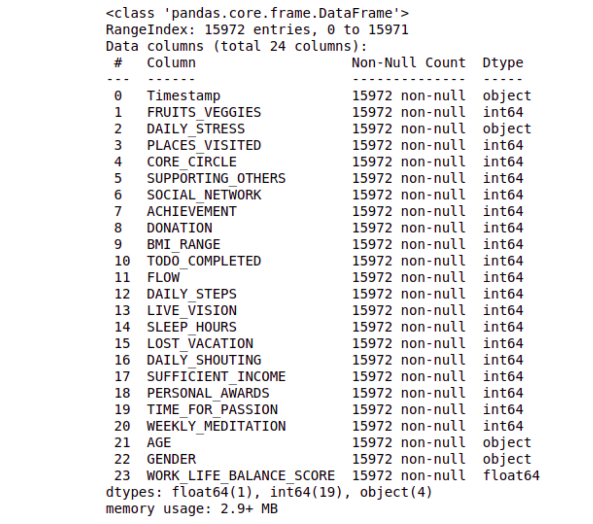
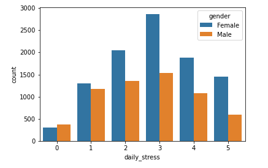
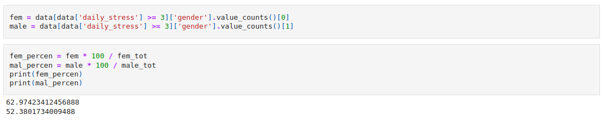
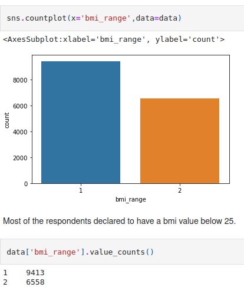
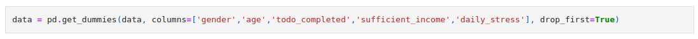
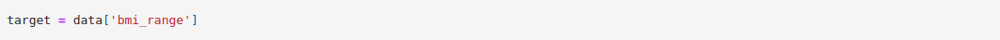
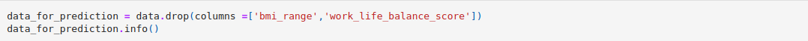
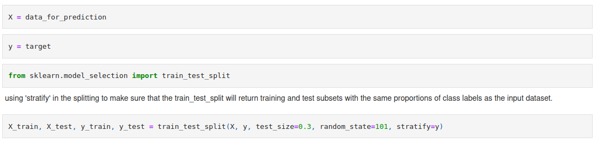

# project_lifestyle

# Table of contents
1. [Introduction](#1-introduction)
2. [Dataset](#2-dataset)

## 1. Introduction
This project was developed using a dataset available in https://www.kaggle.com/datasets/ydalat/lifestyle-and-wellbeing-data?resource=download. The survey used to gather this data can be found in http://www.authentic-happiness.com/your-life-satisfaction-score and includes 24 attributes describing how we live our lives, including a calculated field, the WorkLifeBalance_Score. After exploring the data, it was built two different machine learning models in order to predict the body mass index from the lifestyle of the respondents.
### Project development

THe development of this project was done according with the following steps:
- Exploratory Data Analysis 
- Data Preparation
- Machine Learning Modelling and Tuning
- Model Evaluation

## 2. Dataset
The dataset has 15971 entries and 24 features described below:
**Timestamp** - Date when survey was submitted.

**FRUITS_VEGGIES** - HOW MANY FRUITS OR VEGETABLES DO YOU EAT EVERYDAY?

**DAILY_STRESS** - HOW MUCH STRESS DO YOU TYPICALLY EXPERIENCE EVERYDAY?

**PLACES_VISITED** - HOW MANY NEW PLACES DO YOU VISIT? * Over a period of 12 months.

**CORE_CIRCLE** - HOW MANY PEOPLE ARE VERY CLOSE TO YOU? * i.e. close family and friends ready to provide you with a long-term unconditional support.

**SUPPORTING_OTHERS** - HOW MANY PEOPLE DO YOU HELP ACHIEVE A BETTER LIFE?

**SOCIAL_NETWORK** - WITH HOW MANY PEOPLE DO YOU INTERACT WITH DURING A TYPICAL DAY? 

**ACHIEVEMENT** - HOW MANY REMARKABLE ACHIEVEMENTS ARE YOU PROUD OF? * Over the last 12 months.

**DONATION** - HOW MANY TIMES DO YOU DONATE YOUR TIME OR MONEY TO GOOD CAUSES? * Over a period of 12 months. 

**BMI_RANGE** - WHAT IS YOUR BODY MASS INDEX (BMI) RANGE?

**TODO_COMPLETED** - HOW WELL DO YOU COMPLETE YOUR WEEKLY TO-DO LISTS?

**FLOW** - IN A TYPICAL DAY, HOW MANY HOURS DO YOU EXPERIENCE "FLOW"? Flow is defined as the mental state, in which you are fully immersed in performing an activity.

**DAILY_STEPS** - HOW MANY STEPS (IN THOUSANDS) DO YOU TYPICALLY WALK EVERYDAY?

**LIVE_VISION**  -  FOR HOW MANY YEARS AHEAD IS YOUR LIFE VISION VERY CLEAR FOR? 

**SLEEP_HOURS** - ABOUT HOW LONG DO YOU TYPICALLY SLEEP?

**LOST_VACATION** - HOW MANY DAYS OF VACATION DO YOU TYPICALLY LOSE EVERY YEAR?

**DAILY_SHOUTING** - HOW OFTEN DO YOU SHOUT OR SULK AT SOMEBODY? * In a typical week.

**SUFFICIENT_INCOME** - HOW SUFFICIENT IS YOUR INCOME TO COVER BASIC LIFE EXPENSES?

**PERSONAL_AWARDS** - HOW MANY RECOGNITIONS HAVE YOU RECEIVED IN YOUR LIFE? 

**TIME_FOR_PASSION** - HOW MANY HOURS DO YOU SPEND EVERYDAY DOING WHAT YOU ARE PASSIONATE ABOUT? 

**WEEKLY_MEDITATION** - IN A TYPICAL WEEK, HOW MANY TIMES DO YOU HAVE THE OPPORTUNITY TO THINK ABOUT YOURSELF?

**AGE** - YOUR AGE RANGE.

**GENDER** - YOUR GENDER.

**WORK_LIFE_BALANCE_SCORE** - CALCULATED SCORE.

When loaded in pandas this dataset file has a memory usage of 2.9 MB.

The dataset was split into train and test set with 70/30 ratio.There are 3 data types of data in the dataset: float64(5), int64(3) and object(3).  As shown in the image above, the dataset does not have NAN values.

## 3. Exploratory data analysis

From the plot above it seems more women are under lots of stress (3 0r more in the stress scale). In order to investigate that, let's look for each group separately (women and men) and see how much of each group declared to experience a lot of daily stress. 

By doing that, we can affirm that the proportion of men and women under much stress in both groups are not very different.

Another feature explored was the "bmi_range" which is the body mass index and is represented by two classes: below 25 and above 25. First, let's see if they are balanced or not.

Even thought most declared to belong to class 1 (below 25), there is not a high imbalance between them.

## 4. Data preparation

Aiming to run a machine learning for this dataset, some data preparation is needed. For example, the columns "daily_stress", "todo_completed", "sufficient_income", "age" and  "gender" are categorical features, thus let's turn them into dummy variables.

 Once there are not nan or missing values, the dataset is ready for a machine learning model. The timestamp column was dropped once in our problem this information did not show much importance.

 After exploring the availabe data, let's use the 'bmi_range' as our target and try to predict it based in the input features.

After exploring our dataset, the quantity taken as the target is the "bmi_range". Therefore, based on the other features, let's try to predicted if someone has a body mass inder below or above 25 from their lifestyle.

For the features, we are going to consider all features from our dataset  except "bmi_range" and "work_life_balance_score". This last one has to be dropped, once it is a calculated field from the answers of the respondents and it takes into account all the other features including "bmi_range".

### Spliting the data

After the steps above, all data is ready to be used a machine learning model. 

## 5. Machine learning modelling

### 5.1.  Models and performance

The following machine learning models were considered to predict the "bmi-range" of the respondents.
* Random Forest
* Logistic Regression

The performance of the models were evaluated by the classification_report and confusion matrix, both of them imported from sklearn.metrics.
### Random Forest

#### Classification report

#### confusion matrix 

[back to top](#table-of-contents)

---
